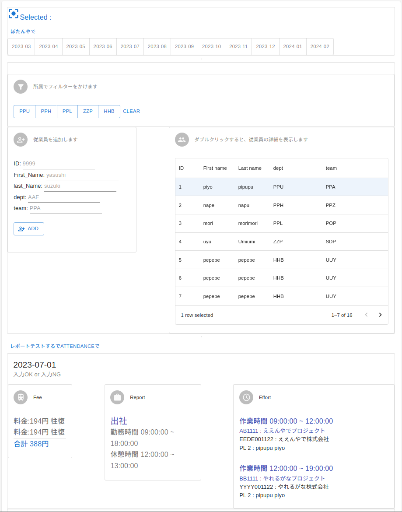

# FeeManage_Front

## システム概要

- 従業員ごとの交通費、出勤記録、工数についてを、一元管理するためのアプリ
- バックエンドはJava（SpringBoot）。別プロジェクトのため、以下リポジトリを参照。
  - https://github.com/snrnapa/FeeManage.git 

## こだわったポイント
- ページ遷移（ページの全リロード）によるストレスをなくすためにSPAにした（react)
- 直感的に見やすいように、レイアウトはグリッドで１２分割にした
- 月ごとのfilterは上記に12ヶ月分が自動生成されるようにした。
- クリック数を少なくする工夫をしている。（従業員情報をクリックするだけで、３つの情報を一気に表示。
- 日付ごとの情報は、見やすいように一緒の場所に表示している。
  - これにより、事実内容の齟齬を見つけやすくしている。
  - 例 7/1は在宅勤務になっているのに、交通費の請求が記載されているな。。。
  - 例 7/2は18時まで勤務になってるのに、18-19時の工数が記載されているな。。。




## 使用してるフレームワーク

[Material UI](https://mui.com/material-ui/getting-started/overview/)

[Material UI のテンプレート](https://mui.com/material-ui/getting-started/templates/)

##　参考にしたサイト
JSX記法の中にif文を書く参考（結構いいサイト）
https://devsakaso.com/react-conditional-branching/

Springboot×React
https://qiita.com/curry__30/items/c91d489551de68adb759

https://github.com/Shin-sibainu/react-tutorial-with-todoapp

package.json

```
"proxy": "http://localhost:8080"
```

## React Effects についての無限レンダリングについて

- https://qiita.com/esoul/items/5ac4ae8260624dde135f
  - そもそもの fetch の書き方。今回、、[]を入れても解消しなかったのはそもそものかっこの書き方がおかしかったから
- https://qiita.com/wafuwafu13/items/0f4230a5301fb44dd796
  - よくある、Effect の無限レンダリングの解消について書いたもの
