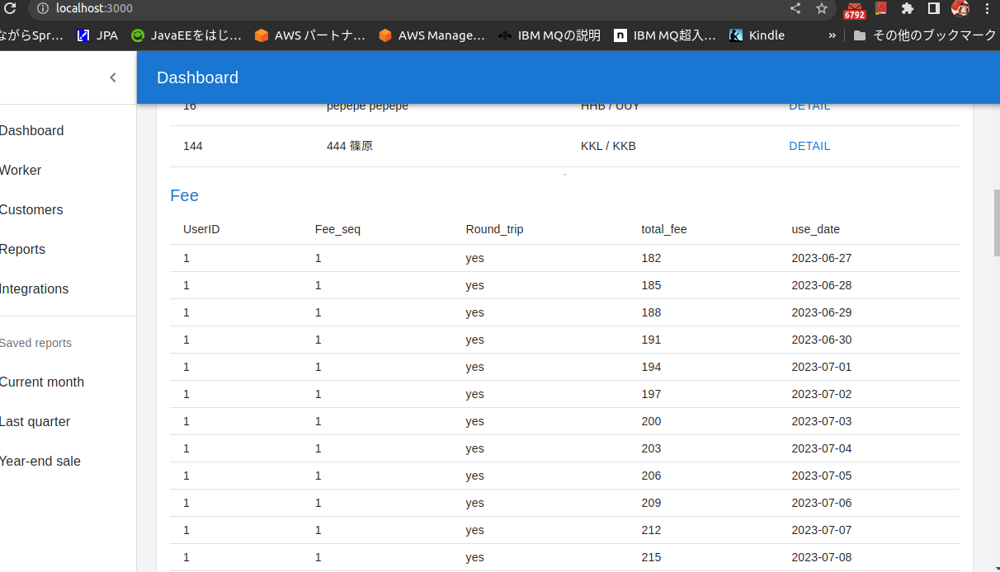

# FeeManage_Front

## 実装したいこと

- workerのアプリの表示は、今Detailにしてるけど、どのユーザーを選択してるかわかりやすくするようにしてほしい（選択中のユーザーは、青くなるとか、トグルボタンにするとか）

- サイドバーを押したときに、アプリが入れ替わるようにしたい
  - 下に表示してるFeeのところは、Feeを移すだけでなう、工数表とか、シュッ大金管理とか移したい
  - 

- workerのところで、ユーザーを選択（Detail）を押したら、wokrerの表示を少なくしてほしい（下のほうがいちいちスクロールしないと見えないのは辛い）


## 使用してるフレームワーク

[Material UI](https://mui.com/material-ui/getting-started/overview/)

[Material UI のテンプレート](https://mui.com/material-ui/getting-started/templates/)

##　参考にしたサイト

Springboot×React
https://qiita.com/curry__30/items/c91d489551de68adb759

https://github.com/Shin-sibainu/react-tutorial-with-todoapp

package.json

```
"proxy": "http://localhost:8080"
```

## React Effects についての無限レンダリングについて

- https://qiita.com/esoul/items/5ac4ae8260624dde135f
  - そもそもの fetch の書き方。今回、、[]を入れても解消しなかったのはそもそものかっこの書き方がおかしかったから
- https://qiita.com/wafuwafu13/items/0f4230a5301fb44dd796
  - よくある、Effect の無限レンダリングの解消について書いたもの
